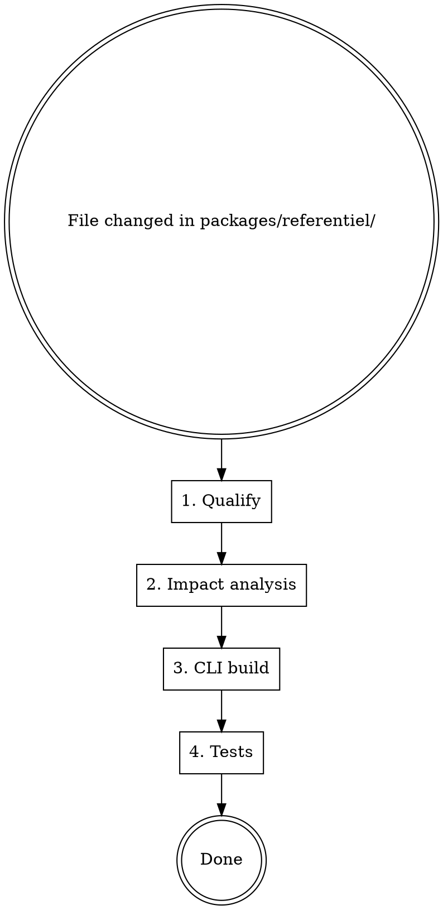

# Référentiel Update Workflow

## Overview

Every modification to `packages/referentiel/` triggers a 4-step workflow: qualify → impact analysis → CLI verification → tests. Never skip steps, even for "just a typo."

**Violating the letter of this workflow is violating its spirit.**

## Workflow



## Step 1 — Qualifier la modification

Run `git diff --name-only` (or `git status`) to identify changed files, then classify:

| Type | Exemples | Impact attendu |
|------|----------|----------------|
| **Contenu** | Correction typo, clarification règle | Faible — vérifier cohérence locale |
| **Structurel** | Nouveau dossier, renommage de section | Moyen — impacte les fichiers qui référencent |
| **Schéma** | Nouvelle convention de nommage, nouveau champ | Élevé — impacte CLI + tous les exemples |
| **Suppression** | Fichier supprimé ou section retirée | Élevé — vérifier toutes les références |

## Step 2 — Identifier et traiter les impacts

### 2a. Cohérence inter-fichiers

Pour chaque fichier modifié, vérifier les dépendances :

| Fichier modifié | Fichiers à vérifier |
|-----------------|---------------------|
| `regles-nommage.md` | Tous les `classement/*.md` (exemples de noms) |
| `classement/__index.md` | `plan-classement.md`, `_index.md` |
| `classement/mes_ventes.md` etc. | `raccourcis-liens.md` (structures référencées) |
| `regles-archivage.md` | `classement/archives.md` |
| `_index.md` | Vérifier que les 8 dossiers listés sont toujours exacts |
| Tout nouveau fichier | `plan-classement.md` (doit pointer vers le nouveau fichier) |

### 2b. Intégrité des références

```bash
# Chercher les liens markdown cassés après un renommage/suppression
grep -r "\[.*\](.*\.md)" packages/referentiel/
```

Vérifier que chaque lien `[texte](fichier.md)` pointe vers un fichier existant.

### 2c. Index et introduction

- `_index.md` décrit-il encore fidèlement le référentiel ?
- `plan-classement.md` liste-t-il encore tous les fichiers de `classement/` ?

## Step 3 — Vérifier la CLI

La CLI walk les fichiers du référentiel sans interpréter leur contenu. Vérifier :

```bash
# Rebuild obligatoire après toute modification
npm run referentiel-cli:build
```

**Si le build échoue :** la modification du référentiel a révélé un problème latent dans la CLI (ex: import de chemin hardcodé). Corriger avant de continuer.

**Questions à se poser :**
- Un nouveau fichier ou dossier a-t-il été ajouté ? → `walkReferentielFiles()` le découvrira automatiquement (pas de changement CLI nécessaire)
- Un fichier a-t-il été renommé ? → La prochaine sync Drive créera le nouveau, mais l'ancien restera sur Drive — prévoir une suppression manuelle si nécessaire
- La structure de dossiers a-t-elle changé ? → Vérifier `packages/referentiel-cli/src/walk-referentiel.ts`

## Step 4 — Lancer les tests

```bash
npm run referentiel-cli:test
```

**Si les tests échouent :** diagnostiquer avant de push. Ne pas commiter avec des tests rouges.

Tests clés à surveiller :
- `walk-referentiel.test.ts` — si la structure de fichiers change, les snapshots peuvent être impactés
- `drive-mirror.logic.test.ts` — vérifier si les chemins attendus ont changé

## Red Flags — STOP

Ces pensées signifient que vous êtes en train de rationaliser :

| Pensée | Réalité |
|--------|---------|
| "C'est juste une typo, inutile de rebuild" | Même une typo peut casser un lien markdown. Faire le workflow complet. |
| "Les tests n'ont pas changé" | Les tests testent le code CLI. La cohérence du référentiel s'analyse manuellement. |
| "Je vérifierai l'impact plus tard" | Il n'y a pas de "plus tard". L'impact se traite maintenant. |
| "La CLI ne lit pas le contenu markdown" | Vrai pour le contenu, mais elle walk la structure. Rebuild quand même. |

## Checklist rapide

- [ ] `git diff --name-only` — identifier les fichiers changés
- [ ] Classifier le type de changement (contenu / structurel / schéma / suppression)
- [ ] Vérifier la cohérence des fichiers dépendants
- [ ] Vérifier l'intégrité des liens markdown
- [ ] `npm run referentiel-cli:build` — build réussi
- [ ] `npm run referentiel-cli:test` — tous les tests passent
- [ ] Commit avec message conventionnel : `docs(referentiel): <description>`
