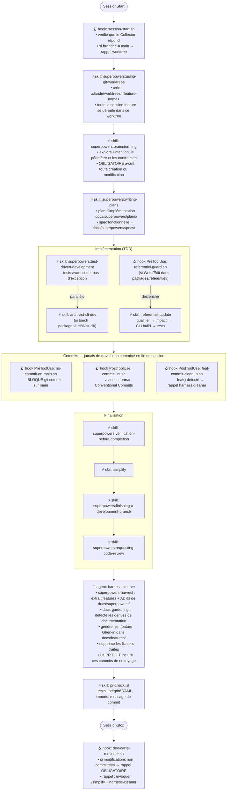

# Harnais Claude Code — archivist-ai

Infrastructure qui cadre l'agent de dev pour garantir qualité, traçabilité et discipline sur le cycle de développement continu.

---

## Cycle de développement d'une feature

Chaque étape ci-dessous est déclenchée ou renforcée par un mécanisme du harnais (hook, skill, agent).



---

## Hooks (`settings.json`)

| Événement | Fichier | Déclencheur | Effet |
|-----------|---------|-------------|-------|
| `SessionStart` | `.harness/scripts/session-start.sh` | Toujours | Rappel worktree si sur main (toujours, même Collector injoignable) ; émet le root span OTEL ; signale si le Collector est injoignable. **Ne démarre pas** la stack — c'est le devcontainer qui le fait |
| `PreToolUse` (Write\|Edit) | `.claude/hooks/referentiel-guard.sh` | Fichier dans `packages/referentiel/` | Rappel d'invoquer `referentiel-update` |
| `PreToolUse` (Bash) | `.claude/hooks/no-commit-on-main.sh` | Commande `git commit` sur main | **Bloque** le commit (`decision: block`) |
| `PostToolUse` (Bash) | `.claude/hooks/commit-lint.sh` | Commande `git commit` | Valide le format Conventional Commits |
| `PostToolUse` (Bash) | `.claude/hooks/feat-commit-cleanup.sh` | Commit `feat()` détecté | Injection `additionalContext` obligatoire : invoquer harness-cleaner |
| `PostToolUse` (Skill) | `.harness/scripts/skill-trace.sh` | Invocation d'un skill | Émet span OTEL GenAI `execute_tool {skill}` + métrique `skill_invoked` vers Tempo/Prometheus |
| `Stop` | `.claude/hooks/dev-cycle-reminder.sh` | Fin de session sur branche feature | Rappel **obligatoire de committer** si modifications non committées ; rappel `/simplify` + harness-cleaner |

---

## Skills projet (`.claude/skills/`)

| Skill | Déclencheur |
|-------|-------------|
| `archivist-cli-dev` | Tout fichier touché dans `packages/archivist-cli/` |
| `referentiel-update` | Tout fichier touché dans `packages/referentiel/` |
| `write-adr` | Rédaction d'un ADR |
| `write-feature` | Rédaction d'une feature Gherkin |
| `pr-checklist` | Avant tout commit ou PR |
| `superpowers-harvest` | Fin de feature — extraction depuis `docs/superpowers/` |
| `docs-gardening` | Invocation manuelle — détection de dérives de documentation |

## Skills superpowers (plugin `superpowers@claude-plugins-official`)

| Skill | Moment d'invocation |
|-------|---------------------|
| `superpowers:using-superpowers` | Démarrage de session — établit le flow |
| `superpowers:using-git-worktrees` | Avant toute feature (brainstorming inclus) |
| `superpowers:brainstorming` | Avant toute création ou modification de comportement |
| `superpowers:writing-plans` | Après brainstorming, avant implémentation |
| `superpowers:test-driven-development` | Avant d'écrire le code d'implémentation |
| `superpowers:systematic-debugging` | Dès qu'un bug ou test en échec est rencontré |
| `superpowers:executing-plans` | Exécution d'un plan dans une session dédiée |
| `superpowers:subagent-driven-development` | Tâches indépendantes parallélisables |
| `superpowers:dispatching-parallel-agents` | 2+ tâches sans dépendances mutuelles |
| `superpowers:verification-before-completion` | Avant toute déclaration de succès |
| `superpowers:finishing-a-development-branch` | Implémentation terminée, tests passants |
| `superpowers:requesting-code-review` | Avant merge |
| `superpowers:receiving-code-review` | À réception d'un retour de review |

---

## Agent harness-cleaner (`.claude/agents/harness-cleaner.md`)

Agent spécialisé post-développement. Invoqué automatiquement en fin de feature (rappelé par `feat-commit-cleanup.sh` et `dev-cycle-reminder.sh`).

Séquence d'exécution :
1. Évalue le contexte : packages modifiés, plans actifs, ADRs manquants
2. Invoque `superpowers-harvest` → extrait features et ADRs de `docs/superpowers/`
3. Invoque `docs-gardening` → liens cassés, packages non documentés, plans périmés
4. Rapport de synthèse : ce qui a été récolté, documentation mise à jour, actions suggérées

---

## Monitoring (`.harness/monitoring/`)

Stack Docker : OTEL Collector → Prometheus + Tempo → Grafana. **Démarre automatiquement avec le devcontainer** (définie dans `.devcontainer/compose.yml`).

- Collector reçoit les events OTEL natifs de Claude Code (gRPC `:4317`) et les spans bash des hooks (HTTP `:4318`)
- Prometheus scrape `:8889` — métriques sessions et skills
- Tempo `:3200` — traces distribuées (waterfall `invoke_agent → execute_tool`)
- Grafana `:3000` — dashboard "Harness Health" (panel "Session Flow Completion" : 10 dernières sessions, ratio X/7)

Les configs sont dans `.devcontainer/lgtm/` (montées en volume par le devcontainer).

Variables d'environnement (dans `settings.json`, section `env`) :

```bash
CLAUDE_CODE_ENABLE_TELEMETRY=1
OTEL_LOGS_EXPORTER=otlp
OTEL_EXPORTER_OTLP_PROTOCOL=grpc
OTEL_EXPORTER_OTLP_ENDPOINT=http://localhost:4317
OTEL_LOG_TOOL_DETAILS=1
```

Spec complète : [`docs/architecture/specs/2026-05-03-harness-monitoring-design.md`](../docs/architecture/specs/2026-05-03-harness-monitoring-design.md)

---

## Scripts (`.harness/scripts/`)

| Script | Usage |
|--------|-------|
| `session-start.sh` | Hook SessionStart — rappel worktree sur main (inconditionnel), émet le root span OTEL GenAI `invoke_agent claude-code`, signale si le Collector est injoignable (ne démarre pas la stack — rôle du devcontainer) |
| `skill-trace.sh` | Hook PostToolUse(Skill) — émet span OTEL GenAI `execute_tool {skill}` + métrique `skill_invoked` |
| `harness-trace.sh` | Lib partagée — `emit_span`, `emit_session_metric`, `emit_skill_metric` via OTLP/HTTP JSON `:4318` |
| `check_claude_coverage.py` | Vérifie que chaque `packages/*` est documenté dans CLAUDE.md |

---

## Règles absolues (résumé)

- **Toujours committer** — aucun travail non committé en fin de session (le hook `Stop` le rappelle si l'arbre de travail est sale)
- **Jamais de commit sur `main`** — le hook bloque, le worktree est obligatoire
- **Brainstorming dans un worktree** — pas de travail feature sur main, même exploratoire
- **harness-cleaner avant la PR** — les commits de nettoyage font partie de la PR
- **ADR avant le code** pour toute décision structurante (voir `docs/architecture/adrs/`)
